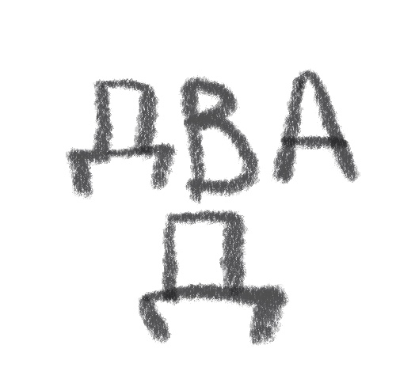
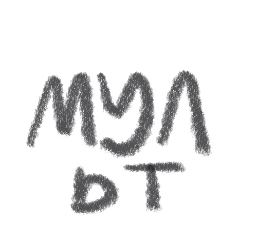
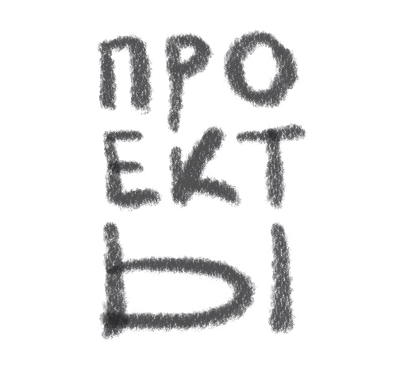

---
# You don't need to edit this file, it's empty on purpose.
# Edit theme's home layout instead if you wanna make some changes
# See: https://jekyllrb.com/docs/themes/#overriding-theme-defaults
layout: single
author_profile: true
---

##2D ART
[(_pages/2d.md)]

##ANIMATION
[(_pages/ani.md)]

##PROJECTS
[(_pages/pro.md)]
